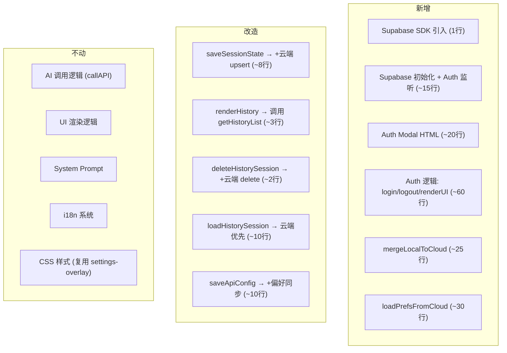
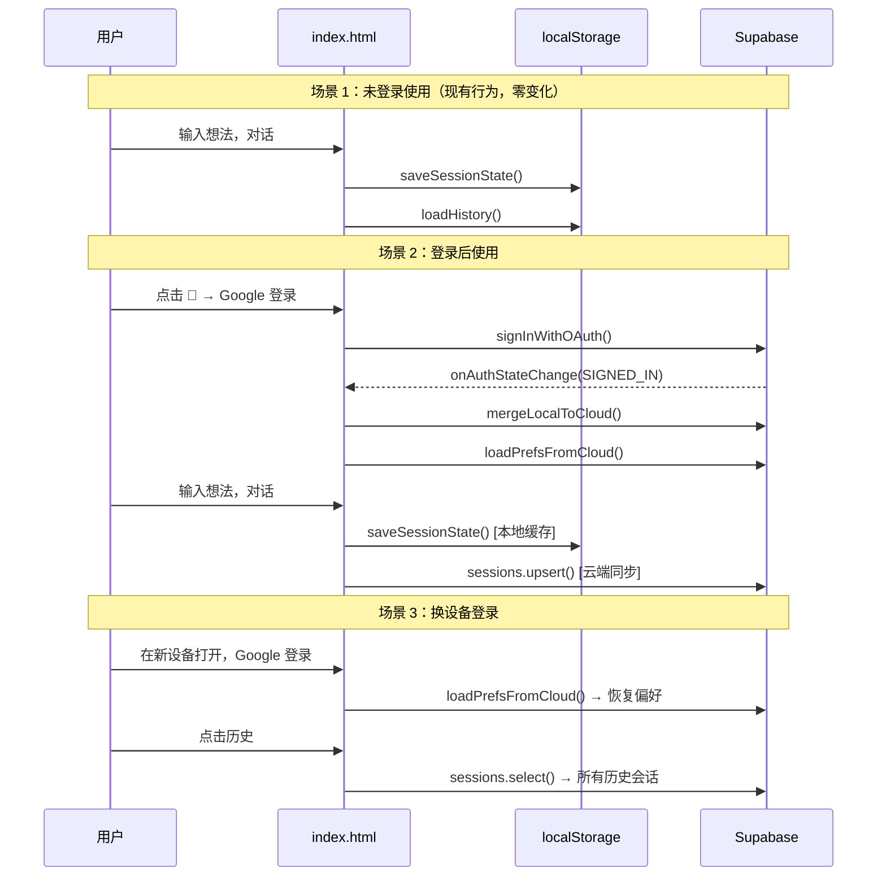

# YC Office Hours — Supabase 账号持久化 MVP 实施方案

## 设计原则

- **保持单文件架构**，通过 CDN 引入 Supabase SDK
- **未登录体验不变**，localStorage 作为默认存储 + 离线降级
- **登录即同步**，透明地将数据存入云端
- **最小改动面**，只改存储层，不动 UI 流程和 AI 逻辑

---

## 一、Supabase 项目配置

### 1.1 创建项目

在 [supabase.com](https://supabase.com) 创建项目，获取：
- `SUPABASE_URL`（如 `https://xxxx.supabase.co`）
- `SUPABASE_ANON_KEY`（公开的 anon key，安全由 RLS 保障）

### 1.2 开启 Auth Provider

在 Supabase Dashboard → Authentication → Providers 中开启：
- **Google**（覆盖大多数用户）
- **GitHub**（开发者群体）

两个 OAuth 均需在对应平台注册应用，将 callback URL 设为 Supabase 提供的地址。

### 1.3 建表 SQL

在 SQL Editor 中执行：

```sql
-- 会话表：存储完整对话历史
create table sessions (
  id text not null,
  user_id uuid references auth.users(id) on delete cascade not null,
  mode text not null check (mode in ('startup', 'builder')),
  history jsonb not null default '[]',
  design_doc text,
  created_at timestamptz default now(),
  updated_at timestamptz default now(),
  primary key (id, user_id)
);

create index idx_sessions_user_time on sessions(user_id, updated_at desc);

-- 用户偏好表：API 配置 + 语言
create table user_preferences (
  user_id uuid references auth.users(id) on delete cascade primary key,
  api_provider text default 'claude',
  api_key_encrypted text,
  api_endpoint text,
  api_model text,
  use_proxy boolean default false,
  preferred_lang text default 'en',
  updated_at timestamptz default now()
);

-- RLS：用户只能操作自己的行
alter table sessions enable row level security;
alter table user_preferences enable row level security;

create policy "own_sessions" on sessions for all using (auth.uid() = user_id);
create policy "own_prefs" on user_preferences for all using (auth.uid() = user_id);
```

> [!NOTE]
> `sessions` 表的主键是 `(id, user_id)` 复合键。`id` 沿用现有的 `Date.now()` 字符串，加上 `user_id` 确保用户隔离。

---

## 二、前端改造

改动集中在 `index.html` 的 `<script>` 部分，分 5 个模块。

### 2.1 SDK 引入 + 初始化

在 `<head>` 的 `marked.js` 之后加入：

```html
<script src="https://cdn.jsdelivr.net/npm/@supabase/supabase-js@2/dist/umd/supabase.min.js"></script>
```

在 `<script>` 顶部，现有全局变量之后加入：

```javascript
// ── Supabase ──
const SB_URL = 'https://your-project.supabase.co';
const SB_KEY = 'eyJ...your-anon-key...';
const sb = window.supabase.createClient(SB_URL, SB_KEY);
let currentUser = null;

sb.auth.onAuthStateChange(async (event, session) => {
  currentUser = session?.user || null;
  updateAuthUI();
  if (event === 'SIGNED_IN') {
    await mergeLocalToCloud();
    await loadPrefsFromCloud();
  }
});
```

### 2.2 Auth UI

#### Header 新增头像按钮

在 `header-right` 区域最右侧，Reset 按钮后面加入：

```html
<button class="btn-settings" id="authBtn" onclick="toggleAuthModal()">👤</button>
```

#### Auth Modal

在 Settings Modal 后面新增一个弹窗：

```html
<div class="settings-overlay" id="authOverlay" onclick="if(event.target===this)closeAuthModal()">
  <div class="settings-panel" style="max-width: 360px;">
    <div class="settings-header">
      <div class="settings-title">🔐 Account</div>
      <button class="settings-close" onclick="closeAuthModal()">×</button>
    </div>
    <div id="authContent">
      <!-- JS 根据登录状态动态填充 -->
    </div>
  </div>
</div>
```

#### Auth 逻辑

```javascript
function toggleAuthModal() {
  document.getElementById('authOverlay').classList.toggle('open');
  renderAuthContent();
}
function closeAuthModal() {
  document.getElementById('authOverlay').classList.remove('open');
}

function renderAuthContent() {
  const el = document.getElementById('authContent');
  if (currentUser) {
    // 已登录：显示用户信息 + 登出
    const name = currentUser.user_metadata?.full_name || currentUser.email;
    const avatar = currentUser.user_metadata?.avatar_url;
    el.innerHTML = `
      <div style="text-align:center; padding: 20px 0;">
        ${avatar ? `` : ''}
        <div style="color:var(--text); font-size:14px; margin-bottom:4px;">${escapeHtml(name)}</div>
        <div style="color:var(--text-dim); font-size:12px; margin-bottom:20px;">${escapeHtml(currentUser.email)}</div>
        <div style="color:var(--green); font-size:11px; margin-bottom:20px;">✓ Data synced to cloud</div>
        <button class="btn-reset" onclick="handleLogout()" style="width:100%;">Sign Out</button>
      </div>`;
  } else {
    // 未登录：Google + GitHub 按钮
    el.innerHTML = `
      <div style="display:flex; flex-direction:column; gap:10px; padding: 16px 0;">
        <div style="color:var(--text-dim); font-size:12px; text-align:center; margin-bottom:8px; line-height:1.6;">
          Sign in to sync your sessions across devices.<br>
          No account needed for local use.
        </div>
        <button class="start-btn" onclick="loginGoogle()" style="width:100%; display:flex; align-items:center; justify-content:center; gap:8px;">
          <span>Continue with Google</span>
        </button>
        <button class="start-btn" onclick="loginGithub()" style="width:100%; background:var(--surface2); color:var(--text); border:1px solid var(--border);">
          Continue with GitHub
        </button>
      </div>`;
  }
}

async function loginGoogle() {
  await sb.auth.signInWithOAuth({ provider: 'google', options: { redirectTo: location.origin + location.pathname } });
}
async function loginGithub() {
  await sb.auth.signInWithOAuth({ provider: 'github', options: { redirectTo: location.origin + location.pathname } });
}
async function handleLogout() {
  await sb.auth.signOut();
  currentUser = null;
  updateAuthUI();
  closeAuthModal();
}

function updateAuthUI() {
  const btn = document.getElementById('authBtn');
  if (!btn) return;
  if (currentUser) {
    const avatar = currentUser.user_metadata?.avatar_url;
    if (avatar) {
      btn.innerHTML = ``;
    } else {
      btn.innerHTML = '✓';
      btn.style.color = 'var(--green)';
    }
  } else {
    btn.innerHTML = '👤';
    btn.style.color = '';
  }
}
```

### 2.3 存储抽象层改造

**核心思路**：在现有 5 个存储函数上包一层。已登录 → 云端优先；未登录 → 纯 localStorage（零行为变化）。

#### saveSessionState → 增加云端写入

```javascript
// 改造现有函数
async function saveSessionState() {
  if (!sessionId) sessionId = Date.now().toString();
  const state = { id: sessionId, mode, history, designDocText, timestamp: Date.now() };

  // 本地缓存（始终写，保证离线可用）
  localStorage.setItem('office_hours_session', JSON.stringify(state));
  updateLocalHistory(state);

  // 云端同步
  if (currentUser) {
    await sb.from('sessions').upsert({
      id: sessionId,
      user_id: currentUser.id,
      mode,
      history,
      design_doc: designDocText,
      updated_at: new Date().toISOString(),
    }, { onConflict: 'id,user_id' }).then(({ error }) => {
      if (error) console.warn('Cloud save failed:', error.message);
    });
  }
}

// 从现有的 saveSessionState 中提取本地历史更新逻辑
function updateLocalHistory(state) {
  let histArr = [];
  try { histArr = JSON.parse(localStorage.getItem('office_hours_history') || '[]'); } catch {}
  const idx = histArr.findIndex(s => s.id === state.id);
  if (idx >= 0) histArr[idx] = state;
  else histArr.unshift(state);
  histArr = histArr.slice(0, 50);
  localStorage.setItem('office_hours_history', JSON.stringify(histArr));
}
```

#### loadHistory → 云端优先

```javascript
async function getHistoryList() {
  if (currentUser) {
    const { data } = await sb.from('sessions')
      .select('id, mode, history, design_doc, created_at, updated_at')
      .order('updated_at', { ascending: false })
      .limit(50);
    if (data) {
      // 转换为前端格式
      return data.map(s => ({
        id: s.id,
        mode: s.mode,
        history: s.history,
        designDocText: s.design_doc,
        timestamp: new Date(s.updated_at).getTime(),
      }));
    }
  }
  // 降级：localStorage
  try { return JSON.parse(localStorage.getItem('office_hours_history') || '[]'); } catch { return []; }
}
```

现有的 `renderHistory()` 改为调用 `getHistoryList()`：

```javascript
async function renderHistory() {
  const list = document.getElementById('historyList');
  const histArr = await getHistoryList();   // ← 唯一改动
  // ... 其余渲染逻辑不变
}
```

#### deleteHistorySession → 增加云端删除

```javascript
async function deleteHistorySession(id) {
  if (currentUser) {
    await sb.from('sessions').delete().eq('id', id).eq('user_id', currentUser.id);
  }
  // 本地也删
  let histArr = [];
  try { histArr = JSON.parse(localStorage.getItem('office_hours_history') || '[]'); } catch {}
  histArr = histArr.filter(s => s.id !== id);
  localStorage.setItem('office_hours_history', JSON.stringify(histArr));
  if (sessionId === id) resetSession();
  renderHistory();
}
```

#### loadHistorySession → 从云端加载会话

```javascript
async function loadHistorySession(id) {
  let saved = null;
  if (currentUser) {
    const { data } = await sb.from('sessions').select('*').eq('id', id).single();
    if (data) {
      saved = { id: data.id, mode: data.mode, history: data.history, designDocText: data.design_doc, timestamp: new Date(data.updated_at).getTime() };
    }
  }
  if (!saved) {
    // 降级本地
    let histArr = [];
    try { histArr = JSON.parse(localStorage.getItem('office_hours_history') || '[]'); } catch {}
    saved = histArr.find(s => s.id === id);
  }
  if (saved) {
    localStorage.setItem('office_hours_session', JSON.stringify(saved));
    closeHistory();
    loadSessionState();
  }
}
```

### 2.4 首次登录：本地数据合并上传

```javascript
async function mergeLocalToCloud() {
  let localSessions = [];
  try { localSessions = JSON.parse(localStorage.getItem('office_hours_history') || '[]'); } catch {}
  if (localSessions.length === 0) return;

  // 获取云端已有的 session IDs
  const { data: cloudSessions } = await sb.from('sessions').select('id');
  const cloudIds = new Set((cloudSessions || []).map(s => s.id));

  // 上传本地独有的
  const toUpload = localSessions.filter(s => !cloudIds.has(s.id));
  if (toUpload.length === 0) return;

  const rows = toUpload.map(s => ({
    id: s.id,
    user_id: currentUser.id,
    mode: s.mode,
    history: s.history,
    design_doc: s.designDocText || null,
    created_at: new Date(s.timestamp).toISOString(),
    updated_at: new Date(s.timestamp).toISOString(),
  }));

  await sb.from('sessions').insert(rows);
}
```

### 2.5 用户偏好云端同步

```javascript
async function saveApiConfig() {
  // ... 现有的 localStorage 写入逻辑保持不变 ...

  // 云端同步（不存 API Key 明文，MVP 阶段 API Key 仅保留在 localStorage）
  if (currentUser) {
    await sb.from('user_preferences').upsert({
      user_id: currentUser.id,
      api_provider: apiProvider,
      api_endpoint: apiEndpoint,
      api_model: apiModel,
      use_proxy: useProxy,
      preferred_lang: lang,
      updated_at: new Date().toISOString(),
    });
  }
}

async function loadPrefsFromCloud() {
  if (!currentUser) return;
  const { data } = await sb.from('user_preferences').select('*').single();
  if (!data) return;

  // 云端偏好覆盖本地（API Key 除外，它只在 localStorage）
  apiProvider = data.api_provider || apiProvider;
  apiEndpoint = data.api_endpoint || apiEndpoint;
  apiModel = data.api_model || apiModel;
  useProxy = data.use_proxy ?? useProxy;
  lang = data.preferred_lang || lang;

  // 更新 localStorage + UI
  localStorage.setItem('api_provider', apiProvider);
  localStorage.setItem('api_endpoint', apiEndpoint);
  localStorage.setItem('api_model', apiModel);
  localStorage.setItem('use_proxy', useProxy);
  localStorage.setItem('app_lang', lang);

  // 重新渲染 UI
  const providerSelect = document.getElementById('apiProvider');
  const endpointInput = document.getElementById('apiEndpoint');
  const modelInput = document.getElementById('apiModel');
  const proxyCheckbox = document.getElementById('useProxy');
  if (providerSelect) providerSelect.value = apiProvider;
  if (endpointInput) endpointInput.value = apiEndpoint;
  if (modelInput) modelInput.value = apiModel;
  if (proxyCheckbox) proxyCheckbox.checked = useProxy;
  applyLang();
}
```

> [!IMPORTANT]
> **MVP 决策：API Key 不上云**。API Key 仅存 localStorage，不同步到 Supabase。这是最安全的选择——用户在新设备上需重新输入 API Key，但避免了加密/解密的复杂度和密钥泄露风险。后续如需跨设备同步 API Key，再加客户端加密。

---

## 三、改动汇总



| 类别 | 新增/改动行数 | 说明 |
|------|-------------|------|
| SDK 引入 | +1 | `<script>` CDN |
| Auth HTML | +20 | Auth Modal，复用现有 settings-overlay 样式 |
| Auth JS | +80 | 登录/登出/状态管理 |
| 存储改造 | +50 | 5 个函数加云端逻辑 |
| 数据合并 | +25 | 首次登录合并 |
| 偏好同步 | +30 | 云端读写偏好 |
| **合计** | **~+200 行** | 文件从 ~2000 行增至 ~2200 行 |

---

## 四、数据流总览



---

## 五、注意事项

1. **OAuth Redirect**：`redirectTo` 设为 `location.origin + location.pathname`，确保文件协议（`file://`）或本地服务器都能正确回调。如果用 `file://` 打开，OAuth 回调会有问题——**需通过 HTTP 服务器访问**（`npx serve .` 或 `python -m http.server`）。

2. **Supabase Anon Key 是公开的**：它不是 secret，可以安全地写在前端代码中。所有安全性由 RLS 策略保障。

3. **错误静默降级**：所有云端操作都 catch 错误并降级到本地，不影响核心使用体验。网络断开时完全不影响使用。

4. **并发冲突**：MVP 阶段采用 latest-write-wins（`upsert`），不做复杂的冲突合并。

5. **存量用户**：已在使用 localStorage 的用户，首次登录时 `mergeLocalToCloud()` 自动把本地数据上传，无需手动迁移。
